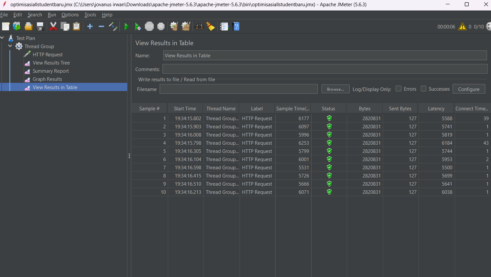
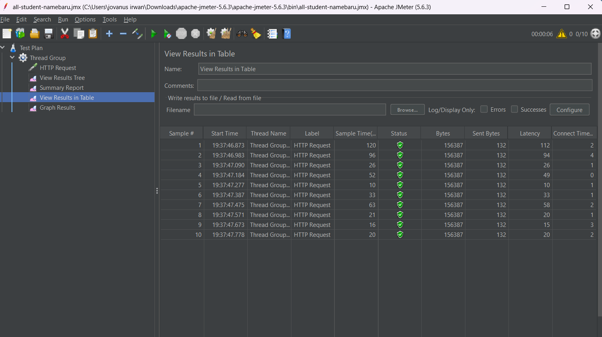
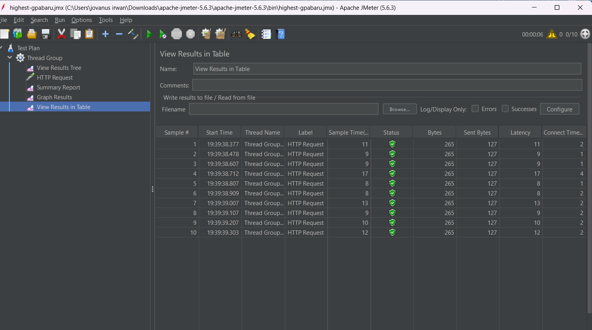

1. What is the difference between the approach of performance testing with JMeter and profiling with IntelliJ Profiler in the context of optimizing application performance?
JMeter itu ibarat kita ngetes aplikasi dari kacamata user eksternal (black-box testing). Tujuannya buat ngeliat metrik dari luar, kayak response time, throughput, dan gimana server nahan beban kalau diakses banyak request barengan. Sebaliknya, IntelliJ Profiler itu white-box testing di mana kita ngebedah aplikasinya dari dalem. Profiler ngeliatin kita behind the scenes-nya JVM beroperasi, kayak alokasi memori dan eksekusi tiap method. Jadi JMeter ngasih tau "seberapa lambat aplikasinya", sedangkan Profiler ngasih tau "kenapa dan di baris mana aplikasi itu lambat".

2. How does the profiling process help you in identifying and understanding the weak points in your application?
Profiling ngebantu banget buat nunjukin "biang kerok" secara presisi. Daripada kita cuma asal tebak bagian kode mana yang bikin lemot, Profiler (lewat Flame Graph atau Call Tree) bisa langsung nunjukin kalau misal ada method yang makan waktu CPU paling lama atau ngabisin memori terlalu gede, contohnya kayak pas ada N+1 queries atau string concatenation di dalem looping.

3. Do you think IntelliJ Profiler is effective in assisting you to analyze and identify bottlenecks in your application code?
Sangat efektif. Visualisasinya ngebantu kita buat langsung nge-spot method mana yang durasi eksekusinya nggak wajar. Jadinya proses debugging performa jauh lebih terarah dan nggak buang-buang waktu tracing kode manual.

4. What are the main challenges you face when conducting performance testing and profiling, and how do you overcome these challenges?
Tantangan utamanya sih di awal ngeliat hasil profiler karena datanya lumayan overwhelming. Banyak banget method bawaan Spring, Hibernate, atau Java yang ikut ke-record dan bikin pusing. Cara ngakalinnya adalah dengan nge-filter atau fokus cuma ke packages kode kita sendiri (com.advpro.profiling...) dan belajar ngebaca Flame Graph buat nyari blok visual yang paling lebar (makan waktu paling lama).

5. What are the main benefits you gain from using IntelliJ Profiler for profiling your application code?
Benefit utamanya jelas ngirit waktu dan nambah pemahaman. Kita ngga perlu lagi pake cara manual nulis System.currentTimeMillis() di mana-mana cuma buat ngecek waktu eksekusi kode. Profiler otomatis ngasih insight komprehensif, dan secara ngga langsung ngajarin kita gimana cara Java/JVM mengeksekusi kode yang udah kita tulis di background.

6. How do you handle situations where the results from profiling with IntelliJ Profiler are not entirely consistent with findings from performance testing using JMeter?
Kalau hasilnya kerasa agak beda, aku bakal nginget lagi kalau JMeter dan Profiler itu ngukur hal yang sedikit berbeda. JMeter ada overhead dari jaringan (network latency), koneksi HTTP, sampe ke connection pool database. Sementara Profiler ngukur eksekusi method secara lokal di level mesin. Kalau ada diskrepansi, biasanya aku bakal ngecek faktor eksternal di luar kode Java-nya, misalnya setingan database atau koneksi jaringannya.

7. What strategies do you implement in optimizing application code after analyzing results from performance testing and profiling? How do you ensure the changes you make do not affect the application's functionality?
Strateginya macem-macem, mulai dari level database (bikin custom query JPA biar cuma ngambil data yang diperluin aja, pake delegasi sorting/limit ke SQL) sampai optimasi level code (ngehindarin nested loop, pake String.join dibanding operator +=). Nah, biar functionality-nya nggak rusak, pastinya harus ngejalanin Unit Test setelah kode kelar di-refactor. Kalau tesnya tetep ijo (pass), berarti kodenya makin kenceng tapi secara logika bisnis (hasil akhirnya) tetep sama persis.